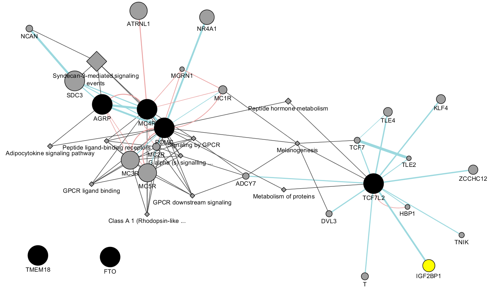

# PW-pipeline

PathWay pipeline using GWAS summary statistics, named analogously after FM-pipepline I have implemented.

## INTRODUCTION

Pathway analysis becomes an important element in GWAS. Broadly, it involves SNP annotation, such as Variant Effect Predictor 
(VEP), gene analysis such as VEGAS2, and gene set analysis. Visualisation of a particular region has been facilitated with 
LocusZoom, while network(s) from pathway analysis via gephi or Cytoscape, which accepts a collection of edges, directed or 
undirected to build a network. Aspects to consider include part or all databases, individual level genotype data vs GWAS 
summary statistics, computing speed, with and without tissue enrichment.



## INSTALLATION

This pipeline involves several software for pathway analysis using GWAS summary statistics, as shown below,

**Full name** | **Abbreviation** | **Reference**
----------------------------------------------------------|--------------|----------
Meta-Analysis Gene-set Enrichment of variaNT Associations | MAGENTA | Segre, et al. (2010)
Multi-marker Analysis of GenoMic Annotation | MAGMA | de Leeuw, et al. (2015)
PAthway SCoring ALgorithm | PASCAL | Lamparter, et al. (2016)
Data-Driven Expression Prioritized Integration for Complex Traits | DEPICT | Pers, et al.(2015)

The full functionality of the pipeline requires availability of individual software for pathway analysis, which should fulfil 
their requirements, e.g., [Matlab](https://www.mathworks.com/products/matlab.html) for MAGENTA, PLINK. It is useful to 
install [xpdf](https://www.xpdfreader.com/) or [ImageMagick](https://www.imagemagick.org/) to produce Excel workbook. By 
default [Sun grid engine](https://en.wikipedia.org/wiki/Oracle_Grid_Engine) is used but this can be any other mechanism such 
as [GNU parallel](https://www.gnu.org/software/parallel/) [note with its --env to pass environment variables]. As usual, 
[R](https://www.r-project.org/) is required.

The pipeline itself can be installed from GitHub in the usual way. Optionally, the chromosomal positions for the current 
build can be downloaded from the UCSC website, which should be helpful for GWAS summary statistics either using chromosomal 
positions from different build or without these at all.
```
wget http://hgdownload.soe.ucsc.edu/goldenPath/hg19/database/snp150.txt.gz
gunzip -c snp150.txt.gz | \
awk '{split($2,a,"_");sub(/chr/,"",a[1]);print a[1],$4,$5}' | \
sort -k3,3 > snp150.txt
```
where it first obtains build 37 positions, sorts them by RSid into the file `snp150.txt`.

## USAGE

The pipeline requires users to specify software to be used as well as database to use. It is possible 
that a given database can be used for several software when appropriate.

The syntax is
```
bash pwp.sh <input file>
```
### Input

The input will be GWAS summary statistics with the following columns **in that order without the header**,

Column | Name | Description
-------|------|------------
1 | SNP | RSid
2 | A1 | Effect allele
3 | A2 | Other allele
4 | freqA1 | A1 frequency
5 | beta | effect estimate
6 | se | standard error of effect
7 | P | P-value
8 | N | sample size
9*  | chr | chromosome
10* | pos | position

\* These two columns can be obtained from UCSC as shown above.

### Output

The output will be available from individual directories named after the software you choose, and optionally in case all software are used the output can also be
an Excel workbook containing combined results.

## EXAMPLE

We can take the GIANT summary statistics as example which requires build 37 positions than can be downloaded from the UCSC website.
```
# GWAS summary statistics
wget http://portals.broadinstitute.org/collaboration/giant/images/1/15/SNP_gwas_mc_merge_nogc.tbl.uniq.gz
gunzip -c SNP_gwas_mc_merge_nogc.tbl.uniq.gz |
awk 'NR>1' | \
sort -k1,1 | \
join -11 -23 - snp150.txt | \
awk '($9!="X" && $9!="Un")' > bmi.txt
```
where file containing the GWAS summary statistics is downloaded, its header dropped, sorted and positional information added leading to a file named `bmi.txt`.
We also filter out nonautosomal SNPs. Now the call is made with
```
pwp.sh bmi.txt
```
We now use data from Scott, et al. (2017),
```
R -q --no-save <<END

library(openxlsx)
library(dplyr)

xlsx <- "http://diabetes.diabetesjournals.org/highwire/filestream/79037/field_highwire_adjunct_files/1/DB161253SupplementaryData2.xlsx"

# Supplementary Table 3. Results for established, novel and additional distinct signals from the main analysis.
ST3 <- read.xlsx(xlsx, sheet = 3, colNames=TRUE, skipEmptyRows = FALSE, cols = 1:20, rows = 2:130) %>% within(
       {
          beta=log(OR)
          L <- as.numeric(substr(CI,1,4))
          U <- as.numeric(substr(CI,6,9))
          se=abs(log(L)-log(U))/3.92
          P=2*(1-pnorm(abs(beta/se)))
       }) %>% select(
          SNP=rsid,
          A1=EA,
          A2=NEA,
          freqA1=EAF,
          beta,
          se,
          P,
          N=Sample.size,
          chr=Chr,
          pos=Position_b37
       )
write.table(ST3, file="ST3", row.names=FALSE, col.names=FALSE, quote=FALSE)

# Supplementary Table 4. BMI-unadjusted association analysis model
ST4 <- read.xlsx(xlsx, sheet = 4, colNames=TRUE, skipEmptyRows = FALSE, cols = 1:12, rows = 3:132) %>% rename(
          "CI"="CI.95%",
          "P"="P-value") %>% within(
       {
          beta=log(OR)
          L <- as.numeric(substr(CI,1,4))
          U <- as.numeric(substr(CI,6,9))
          se=abs(log(L)-log(U))/3.92
          P=2*(1-pnorm(abs(beta/se)))
       }) %>% select(
          SNP=rsid,
          A1=allele1, 
          A2=allele2,
          freqA1=freq1,
          beta,
          se,
          P,
          N,
          chr,
          pos=position_b37
       )
write.table(ST4, file="ST4", row.names=FALSE, col.names=FALSE, quote=FALSE)

END

pwp.sh ST4 &
```
where we generate data based on the paper's supplementary tables ST3 and ST4, which is formatted as input.

## FEATURES

The pipeline puts together analyses involving several software using a unified input format and customises databases across 
software, with the ability to collect results from them and add features such as FDRs and graphics with possibility for 
additional analyses. The other aspect is that software such as MAGENTA and PASCAL could take long time while MAGENTA would 
normally require a copy for a particular user and run interactively which would vie for resources with other interactive 
sessions. The pipeline enables them run on noninteractive clusters.

Several flags are notable: 

* `collection_only.` If setting to 1, it only collects all available software outputs to form a final Excel file.
* `mp.` If setting to 1 it will regenerate multiple precision P and -log10(P) values from z, which is necessary when |z| is 
very large and P=0, -log10(P)=infinity. 
* `min_gs_size.` By default, the mininum number of genes contained in a pathway is five rather than 10 in order to be consistent with other software and 
this can be changed to 10 via `min_gs_size` in the script if you intend to use the same threshold as MAGENTA.
* `max_gs_size.` By default, the maximum number of genes contained in a pathway is 2000 but this can be changed as above.
* `p_threshold.` This is to compromise the suggestion that DEPICT is run twice, for P<=5 x 10^(-8) and P<= 5 x 10^-5, respectively.

Moreover, potential downstream analysis such as clustering significant pathways and network of pathways is illustrated with 
[network.sh](files/network.sh), which performs affinity propagation and k-means clustering as well as generates SIF and EL formats to be used by
software such as Cytoscape.

Individual software are briefly described as follows.

1. **MAGENTA**. Segre, et al. (2010) describes how it works: 

* DNA variants, e.g. single-nucleotide polymorphisms (SNPs), are mapped onto genes. 

* each gene is assigned a gene association score that is a function of its regional SNP association p-values. 

* confounding effects on gene association scores are identified and corrected for, without requiring genotype data (enabling 
use of meta-analyses or other types of GWA studies where only variant association statistics are available).

* a Gene Set Enrichment Analysis (GSEA)-like statistical test is applied to predefined biologically relevant gene sets to 
determine whether any of the gene sets are enriched for highly ranked gene association scores compared to randomly sampled 
gene sets of identical size from the genome.``

It maps SNPs to genes taking 110 Kb upstream and 40 Kb downstream of each gene as extended boundaries to include regulatory 
regions. Each gene is then assigned a genetic set (GS) score, which is the P-value of the most significant SNP within the 
gene’s extended boundaries, corrected for potential confounding factors of physical and genetic properties of genes through a 
step-wise multiple linear regression.

2. **MAGMA**. It consists of three steps: annotation (`--annotate`), gene analysis-SNP p values (`--pval --gene-annot`), and
gene-set analysis (`--gene-results --set-annot`).

The gene-set analysis is divided into two parts. 

* a gene analysis is performed to quantify the degree of association each gene has with the phenotype. In addition the 
correlations between genes are estimated. These correlations reflect the LD between genes, and are needed in order to 
compensate for the dependencies between genes during the gene-set analysis.

* the gene p-values and gene correlation matrix are then used to perform the actual gene-set analysis.

3. **PASCAL**. Gene scores are obtained by aggregating SNP p-values from a GWAS meta-analysis while 
correcting for LD using a reference population via the max and sum of chi-squared statistics based on 
the most significant SNP and the average association signal across the region, respectively. Gene 
sets are based on external databases for reported pathways by combining the scores of genes that 
belong to the same pathways. Pathway enrichment of high-scoring (potentially fused) genes is 
evaluated using parameter-free procedures (chi-square or empirical score), avoiding any p-value 
cut-off inherent to standard binary enrichment tests.

4. **DEPICT**. It is a computational framework for gene prioritization, GSEA and tissue/cell type 
enrichment analysis. The GSEA is perfomed by testing whether genes in GWAS-associated loci are 
enriched for reconstituted versions of known molecular pathways (jointly referred to as reconstituted 
gene sets). The reconstitution is accomplished by identifying genes that are co-regulated with other 
genes in a given gene set based on a panel of 77,840 gene expression microarrays. Genes that are 
found to be transcriptionally co-regulated with genes from the original gene set are added to the 
gene set, which results in the reconstitution. DEPICT also facilitates tissue and cell type 
enrichment analyses by testing whether the genes in associated regions are highly expressed in any of 
the 209 MeSH annotations for 37,427 microarrays on the Affymetrix U133 Plus 2.0 Array platform.

The `p.adjust` function in `R/stats` can be used to obtain FDRs and count the number of pathways 
reaching FDR<=0.05. It implements the so-called Benjamini-Hochberg (BH) procedure, which attempts to 
control for expected proportion of false discoveries among the rejected hypotheses (i.e., those with 
p values below 0.05) and most powerful for independent tests. The BH procedure for an m number of 
tests (pathways) achieves false discovery rate at level α by finding the largest number k such that p 
values is no greater than (k/m)α, and declares only those below this threshold as being significant, 
https://en.wikipedia.org/wiki/False_discovery_rate.

## DATABASES

Several databases can be supplied to MAGENTA, MAGMA and PASCAL while by default DEPICT uses its own database. The following table helps to choose specific software 
and database combinations,

Database | MAGENTA | MAGMA | PASCAL | DEPICT
---------|---------|-------|--------|-------
MAGENTA  |   x     |   x   |  x
MSigDB/c2|   x     |   x   |  x
MSigDB   |   x     |   x   |  x
DEPICT   |         |       |        |   x
DEPICT*  |   x     |   x   |  x     |   x  

\* The common database to all software is derived from [a database from DEPICT 
website](https://data.broadinstitute.org/mpg/depict/depict_download/reconstituted_genesets/GPL570-GPL96-GPL1261-GPL1355TermGeneZScores-MGI_MF_CC_RT_IW_BP_KEGG_z_z.txt.gz).

Except DEPICT, MAGENTA database, all or part (c2) of pathways in Molecular Signatures Database (MSigDB) can also be used. An 
entry in MAGENTA database contains a database ID, a pathway ID, followed by a list of Entrez gene IDs. Although MSigDB has an 
additional column after the pathway ID indicating URLs of the pathway, it would be ignored by MAGMA for instance since these 
URLs do not match any Entrez gene IDs thus has no effect on the results. This feature facilitates use of software 
considerably. Comparative as well as individual results including figures are kept in Excel workbooks called mmp.xlsx, 
depict.xlsx and xlsx.xlsx, respectively.

Additional details about these databases are described here.

1. **MAGENTA**. There are six databases (.db) with a total of 10,327 entries were distributed with the MATLAB implementation: 

Name | Entries
-----|--------
GO_terms_BioProc_MolFunc | 9,433
Ingenuity_pathways | 92
KEGG_pathways | 168
PANTHER_BioProc | 241
PANTHER_MolFunc | 252
PANTHER_pathways | 141

Only 2,529 contain 10 or more genes were used by MAGENTA by default, leading to Bonferroni threshold 0.05/2529=1.977066e-05 when only this subset is used.

2. **MSigDB** (http://software.broadinstitute.org/gsea/msigdb/collections.jsp). The MSigDB v6.0 is 
divided into 8 major collections and several sub-collections on 17,779 gene sets, c2 containing 4,731 
curated gene sets (from various sources such as online pathway databases, the biomedical literature, 
and knowledge of domain experts. MSigDB/BIOCARTA_KEGG_REACTOME came as default to PASCAL and MSigDB 
v4.0 is distributed with PASCAL.

Name | Entries | Bonferroni threshold
-----|---------|---------------------
c2.all.v6.0.entrez.gmt | 4,731 | 1.056859015007398e-05
msigBIOCARTA_KEGG_REACTOME.gmt | 1,077 | 4.642525533890436e-05
msigdb.v4.0.entrez.gmt | 10,295 | 4.85672656629431e-06
msigdb.v6.0.entrez.gmt | 17,779 | 2.81230665391754e--06

3. **DEPICT**. Some of the entries are described in the following table,

Gene database | Entries
--------------|--------
Protein molecular pathways | 5,984 
Phenotypic gene sets | 2,473 
Reactome database pathways | 737 
KEGG pathways and gene ontology terms | 184 

The protein molecular pathways were deribed from 169,810 high-confidence experimentally derived protein-protein interactions, 
the phenotypic gene sets were from from 211,882 gene-phenotype pairs from the mouse genetics initiative and 5,083 gene 
ontology terms.

An additional note relates to the DEPICT database: while it is appropriate for comparison, many 
entries are named after the ENSEMBL GENEID, e.g., ENSG00000000419, linking a reconstituted geneset 
containing C20orf11 (3.2), TOMM22 (3.1), CSDA (2.3), C5orf47 (2.2), EIF4EBP1 (2.2), NCK1 (2.2), 
ZNF337 (2.2), GORASP2 (2.1), KDELR3 (2.1), SNX17 (2.1), FAM208B (2.0), ENSG00000243155 (1.9), 
ENSG00000227195 (1.9), GDI2 (1.9), INHBB (1.8), OCIAD1 (1.7), SMU1 (1.7), ENTPD6 (1.6), LRRC41 (1.6), 
EIF2B4 (1.6), IRAK3 (1.5), SUMF2 (1.4), CCDC117 (1.4), POMGNT1 (1.3), NANP (1.3), SLC17A9 (1.3), 
TMEM14B (1.3), CRLS1 (1.2), APTX (1.2), SBNO1 (1.2), MPV17 (1.2), EXD1 (1.2), DNAJB14 (1.2), CALCR 
(1.2), GSPT1 (1.1), ENSG00000228389 (1.1), METAP1D (1.0), MYCBP (1.0), RSL1D1 (0.9), IFT172 (0.9), 
SLC25A12 (0.9), C11orf46 (0.9), PIWIL1 (0.9), ABHD12 (0.9), EIF3M (0.8), CBY1 (0.8), SLCO4A1 (0.8), 
ODF1(0.8), SUV420H2 (0.8), TNFRSF17 (0.7) with value in the bracket being the z-score in the original 
DEPICT database, so extra work is required to work out the gene SYMBOL in pathways. This can be done 
via R/ensembldb as follows,
```
library(EnsDb.Hsapiens.v86)
chrall <- select(EnsDb.Hsapiens.v86, keys=paste(1:22), keytype="SEQNAME")
chrall_table <- subset(chr22[selcol],!duplicated(chr22[selcol]))
write.table(chrall_table,file="GS.txt",quote=FALSE,row.names=FALSE,col.names=FALSE)
```
So ENSG00000000419 corresponds to DPM1, ENSG00000243155 to RP11-46A10.5 but ENSG00000228389 does not 
correspond to any symbol. In general, a gene symbol may be mapped to more than one GENEID.

As for Gene Ontology and Mammalian Phenotype Ontology this could be done similarly,
```
library(GO.db)
x <- as.list(GOTERM)
golist <- c("GO:0000002","GO:0000018")
x[golist]

library(rols)
mplist <- c("MP:0000003","MP:0000005")
for(i in mplist) print(term("MP",i))
```
A pre-prepared table is also available as [id_descrip.txt.gz](files/id_descrip.txt.gz) which will be complementary to these.

## ACKNOWLEDGEMENTS

The work drives from comparison of software performances using our own GWAS data. The practicality of a common DEPICT database to all software 
here was due to PASCAL developer(s). At the end of our implementation it came to our attention that similar effort has been made, e.g., 
[DEPICT-pipeline](https://github.com/RebeccaFine/DEPICT-pipeline) and other adaptations.

## RELATED LINKS

* [BioGRID](https://thebiogrid.org/): an interaction repository with data compiled through comprehensive curation efforts.
* [Cytoscape](http://www.cytoscape.org/): Network Data Integration, Analysis, and Visualization in a Box.
* [Osprey](https://osprey.thebiogrid.org/): Network Visualization System.
* [GeneMANIA](http://genemania.org/): Imports interaction networks from public databases from a list of genes with their annotations 
and putative functions.
* [VisANT](http://visant.bu.edu/): Visual analyses of metabolic networks in cells and ecosystems.

## SOFTWARE AND REFERENCES

[DEPICT](https://data.broadinstitute.org/mpg/depict/) ([GitHub](https://github.com/perslab/depict))

Pers TH et al.(2015) Biological interpretation of genome-wide association studies using predicted gene functions. Nat Commun. 6:5890. doi: 10.1038/ncomms6890.

[MAGENTA](https://software.broadinstitute.org/mpg/magenta/)

Segre AV, et al (2010). Common Inherited Variation in Mitochondrial Genes Is Not Enriched for Associations with Type 2 Diabetes or Related Glycemic Traits. PLoS 
Genet. 12;6(8). pii: e1001058. doi: 10.1371/journal.pgen.1001058

[MAGMA](http://ctg.cncr.nl/software/magma)

de Leeuw C, et al. (2015) MAGMA: Generalized Gene-Set Analysis of GWAS Data. PLoS Comput Biol. 11(4): e1004219. doi:  10.1371/journal.pcbi.1004219

[PASCAL](http://www2.unil.ch/cbg/images/3/3d/PASCAL.zip) ([GitHub](https://github.com/dlampart/Pascal))

Lamparter D, et al. (2016) Fast and Rigorous Computation of Gene and Pathway Scores from SNP-Based Summary Statistics. PLoS Comput Biol. 2016 Jan 25;12(1):e1004714. 
doi: 10.1371/journal.pcbi.1004714

**GIANT paper**

Locke AE, et al. (2015) Genetic studies of body mass index yield new insights for obesity biology. Nature 518(7538):197-206. doi: 10.1038/nature14177

**DIAGRAM paper**

Scott R, et al. (2017) An Expanded Genome-Wide Association Study of Type 2 Diabetes in Europeans. Diabetes 66:2888–2902.
