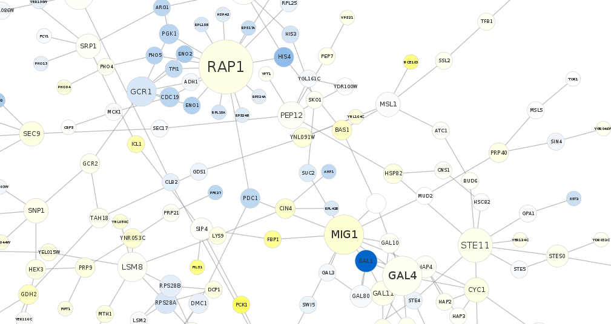

## PW-pipeline

PathWay pipeline using GWAS summary statistics, named in analogy with FM-pipepline I have implemented.



### Introduction

Pathway analysis becomes an important element in GWAS. Broadly, it involves SNP annotation, such as Variant Effect Predictor (VEP), gene analysis such as VEGAS2, 
and gene set analysis. Visualisation of a particular region has been facilitated with LocusZoom, while network(s) from pathway analysis via gephi or Cytoscape, 
which accepts a collection of edges, directed or undirected to build a network. Aspects to consider include part or all databases, individual vs summary statistics, 
computing speed, with and without tissue enrichment.

### Methods

This repository inovles several software for pathway analysis using GWAS summary statistics, as shown below,

Full name | Abbreviation | Reference
----------|--------------|----------
Meta-Analysis Gene-set Enrichment of variaNT Associations | MAGENTA | Segre, et al (2010)
Generalized Gene-Set Analysis of GWAS Data | MAGMA | de Leeuw, et al. (2015)
Pathway scoring algorithm | PASCAL | Lamparter, et al. (2016)
Data-Driven Expression Prioritized Integration for Complex Traits | DEPICT | Pers, et al.(2015)

Their features are briefly described as follows.

1. **MAGENTA**. It first maps SNPs to genes taking 110 Kb upstream and 40 Kb downstream of each gene as extended boundaries to include regulatory regions. Each gene 
is then assigned a genetic set (GS) score, which is the P-value of the most significant SNP within the gene’s extended boundaries, corrected for six potential 
confounding factors of physical and genetic properties of genes through a step-wise multiple linear regression: 
* the physical size of the gene
* number of SNPs per kilobase for each gene
* estimated number of independent SNPs per gene
* number of recombination hotspots spanning each gene
* genetic distance of the gene 
* linkage disequilibrium (LD) unit distance per gene

2. **MAGMA**. The gene-set analysis is divided into two parts. In the first part a gene analysis is performed to quantify the degree of association each gene has 
with the phenotype. In addition the correlations between genes are estimated. These correlations reflect the LD between genes, and are needed in order to compensate 
for the dependencies between genes during the gene-set analysis. The gene p-values and gene correlation matrix are then used in the second part to perform the 
actual gene-set analysis.

3. **PASCAL**. Gene scores are obtained by aggregating SNP p-values from a GWAS meta-analysis while correcting for LD using a reference population via the max and 
sum of chi-squared statistics based on the most significant SNP and the average association signal across the region, respectively. Gene sets are based on external 
databases for reported pathways by combining the scores of genes that belong to the same pathways. Pathway enrichment of high-scoring (potentially fused) genes is 
evaluated using parameter-free procedures (chi-square or empirical score), avoiding any p-value cut-off inherent to standard binary enrichment tests.

4. **DEPICT**. It performs gene set enrichment analyses by testing whether genes in GWAS-associated loci are enriched for reconstituted versions of known molecular 
pathways (jointly referred to as reconstituted gene sets). The reconstitution is accomplished by identifying genes that are co-regulated with other genes in a given 
gene set based on a panel of 77,840 gene expression microarrays. Genes that are found to be transcriptionally co-regulated with genes from the original gene set are 
added to the gene set, which results in the reconstitution. DEPICT also facilitates tissue and cell type enrichment analyses by testing whether the genes in 
associated regions are highly expressed in any of the 209 MeSH annotations for 37,427 microarrays on the Affymetrix U133 Plus 2.0 Array platform.

### Databases

Several databases can be supplied to MAGENTA, MAGMA and PASCAL. By default DEPICT uses its own database, a [companion 
database](https://data.broadinstitute.org/mpg/depict/depict_download/reconstituted_genesets/GPL570-GPL96-GPL1261-GPL1355TermGeneZScores-MGI_MF_CC_RT_IW_BP_KEGG_z_z.txt.gz) 
from DEPICT website has also been converted to supply to all software.

1. **MAGENTA**. The six databases (\_db) contain a total of 10,327 entries were distributed with the MATLAB implementation: 

Name | Entries
-----|--------
GO_terms_BioProc_MolFunc | 9,433
Ingenuity_pathways | 92
KEGG_pathways | 168
PANTHER_BioProc | 241
PANTHER_MolFunc | 252
PANTHER_pathways | 141

Only 2,529 contain 10 or more genes were used by MAGENTA by default, leading to Bonferroni threshold 0.05/2529=1.977066e-05.

2. **MSigDB**. The MSigDB is divided into 8 major collections and several sub-collections on 17,779 gene sets, c2 containing 4,731 curated gene sets (from various 
sources such as online pathway databases, the biomedical literature, and knowledge of domain experts. MSigDB/BIOCARTA_KEGG_REACTOME came as default to PASCAL and 
MSigDB v4.0 is distributed with PASCAL.

Gene database | Entries | Bonferroni threshold
--------------|---------|---------------------
c2.all.v6.0.entrez.gmt | 4,731 | 1.056859015007398e-05
msigBIOCARTA_KEGG_REACTOME.gmt | 1,077 | 4.642525533890436e-05
msigdb.v4.0.entrez.gmt | 10,295 | 4.85672656629431e-06
msigdb.v6.0.entrez.gmt | 17,779 | 2.81230665391754e--06

3. **DEPICT**. Some of the entries are described in the following table,

Gene database | Entries
--------------|--------
Protein molecular pathways derived from 169,810 high-confidence experimentally derived protein-protein interactions | 5,984 
Phenotypic gene sets derived from 211,882 gene-phenotype pairs from the Mouse Genetics Initiative | 2,473 
Reactome database pathways | 737 
Kyoto Encyclopedia of Genes and Genomes (KEGG) database pathways and 5,083 Gene Ontology database terms | 184 

An entry in the MAGENTA pathway database contains a pathway ID, followed by a list of Entrez gene IDs. Although MSigDB has an additional column after the pathway ID 
indicating URLs of the pathway, it would be ignored by MAGMA for instance since these URLs do not match any Entrez gene IDs thus has no effect on the results. This 
feature facilitates comparison of software considerably. Comparative as well as individual results including figures are kept in two excel workbooks called mmp.xlsx 
and xlsx.xlsx, respectively. Except DEPICT, category 2 (c2) or all of pathways in Molecular Signatures Database (MSigDB) v6 is used.

For the discretised DEPICT-to-PASCAL database involving ENSEMBL IDs, the following code readily helps,
```
library(EnsDb.Hsapiens.v86)
chrall <- select(EnsDb.Hsapiens.v86, keys=paste(1:22), keytype="SEQNAME")
chrall_table <- subset(chr22[selcol],!duplicated(chr22[selcol]))
write.table(chrall_table,file="GS.txt",quote=FALSE,row.names=FALSE,col.names=FALSE)
```

### Acknowledgements

The work drives from comparison of their performance using our own GWAS data. The practicality of a common DEPICT database to all software here was due to PASCAL 
developer(s).

### Software and references

[DEPICT](https://data.broadinstitute.org/mpg/depict/) ([GitHub](https://github.com/perslab/depict))

Pers TH et al.(2015) Biological interpretation of genome-wide association studies using predicted gene functions. Nat Commun. 6:5890. doi: 10.1038/ncomms6890.

[MAGENTA](https://software.broadinstitute.org/mpg/magenta/)

Segre AV, et al (2010). Common Inherited Variation in Mitochondrial Genes Is Not Enriched for Associations with Type 2 Diabetes or Related Glycemic Traits. PLoS 
Genet. 12;6(8). pii: e1001058. doi: 10.1371/journal.pgen.1001058

[MAGMA](http://ctg.cncr.nl/software/magma)

de Leeuw C, et al. (2015) MAGMA: Generalized Gene-Set Analysis of GWAS Data. PLoS Comput Biol. 11(4): e1004219. doi:  10.1371/journal.pcbi.1004219

[PASCAL](http://www2.unil.ch/cbg/images/3/3d/PASCAL.zip) ([GitHub](https://github.com/perslab/depict))

Lamparter D, et al. (2016) Fast and Rigorous Computation of Gene and Pathway Scores from SNP-Based Summary Statistics. PLoS Comput Biol. 2016 Jan 25;12(1):e1004714. 
doi: 10.1371/journal.pcbi.1004714
